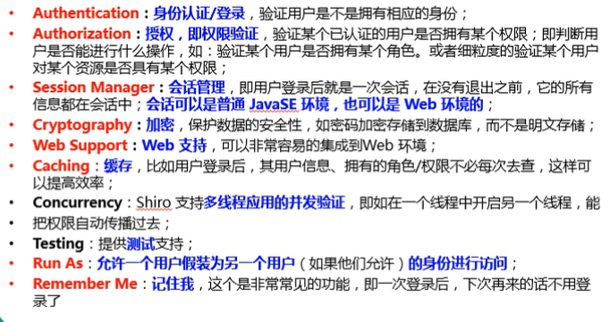
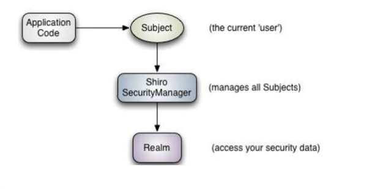
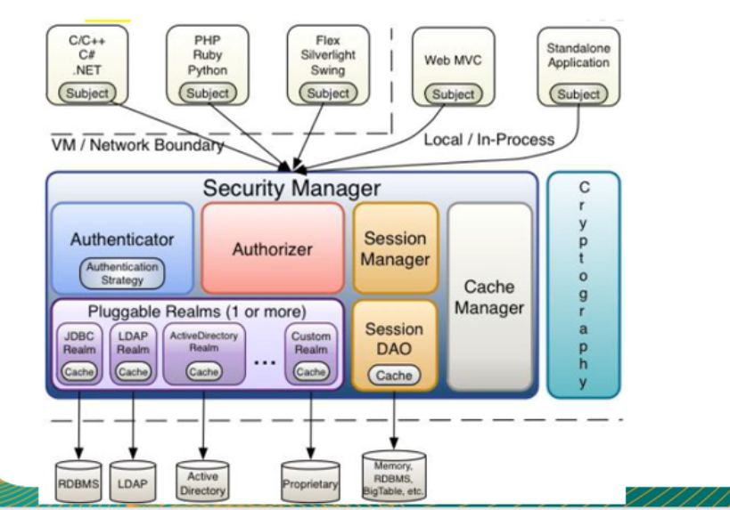
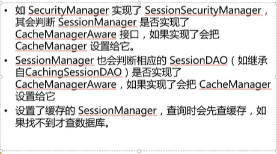

# Shiro

## 简介

Apache shiro是Java的一个安全(权限)框架

shiro可以非常容易的开发足够好的应用，其不仅可以用在javaSE环境，也可以使用在javaee环境

Shiro可以完成：认证、授权、加密、会话管理、与web集成、缓存等等

下载：http://shiro.apache.org


## 功能简介




## Shiro架构

从外部看Shiro，即从应用程序角度来观察如何使用shiro完成工作



Subject：应用代码直接交互的对象是Subject，也就是说Shiro的对外API核心就是Subject。Subject代表了当前的"用户"，这个用户不一定是一个具体的人

Subject是一个门面，与Subject的所有交互都会委托给SecurityManager

SecurityManager：安全管理器;所有与安全有关的操作都会与SecurityManager进行交互。并且连接了其他的组件，是一个核心类

Realm：Shiro从Realm获取安全信息（如用户、角色、权限），也就是说SecurityManager要验证用户身份，那么它就需要从Realm得到相应的用户进行比较以确定用户身份是否合法



Authenticator：负责Subject认证，是一个扩展节点，可以自定义实现；可以使用认证策略，即什么情况认为用户通过了

Authorizer：授权器、用来决定主体是否有权限进行相应操作；**控制用户可以访问应用中的那些功能**

Realm：可以有一个或者多个Realm，可以认为是安全试题数据源，即用于获取安全实体的，可以是JDBC实现，也可以是内存实现。由用户提供，所以可以实现自己的Realm

SessionManager：管理Session生命周期的组件

CacheManager：缓存控制器，用户管理用户、角色、权限等的缓存

Cryptography：密码模块。用于密码的加密和解密


## Shiro的执行流程


1、Shiro提供了与web集成的支持，其通过一个ShiroFilter入口来拦截需要安全控制的URL，然后进行相应的控制

2、ShiroFilter类是前端控制器，安全控制的入口点，其负责读取配置（如ini配置），然后判断URL是否需要登录/权限等工作


总结：

这里的shiro仅仅是作为一个拦截器，首先判断是否符合条件，如果不符合就不给进入


为什么xml配置的proxyfilter一定要和spring配置上的id一致？

```java
<filter>
  <filter-name>shiro</filter-name>
  <filter-class>org.springframework.web.filter.DelegatingFilterProxy</filter-class>
  <init-param>
    <param-name>targetFilterLifecycle</param-name>
    <param-value>true</param-value>
  </init-param>
</filter>
<filter-mapping>
  <filter-name>shiro</filter-name>
  <url-pattern>/*</url-pattern>
</filter-mapping>
```

filter-name的名字一定要和配置文件设置的ShiroFilterFactoryBean的id一致。

当然也可以设置一个

<init-param>

<param-name>targetBeanName</param-name>
 <param-value>name</param-value>

</init-param>

来显示的表达设置的beanname

```java
protected Filter initDelegate(WebApplicationContext wac) throws ServletException {
   Filter delegate = wac.getBean(getTargetBeanName(), Filter.class);
   if (isTargetFilterLifecycle()) {
      delegate.init(getFilterConfig());
   }
   return delegate;
}
```

从上面可以知道，它会去ioc容器里面去寻找getTargetBeanName对应名字的Filter组件，并将它作为一个过滤器，拦截请求。


## 如何配置被保护的url

#### 部分细节

[urls]部分配置，其格式是：url=拦截器[参数],拦截器[参数]

如果当前请求的url匹配[urls]部分的某一个url模式，将会执行对应配置的拦截器

anon拦截器表示匿名访问（即不需要登录）

authc拦截器表示需要身份认证通过后才能访问

#### 匹配模式：

支持 ?  *  **来进行匹配

#### 匹配顺序

URL权限采取第一次匹配优先的方式，即从头开始使用第一个匹配的url模式对应的拦截器，按照配置顺序来进行加载

## 认证思路分析

流程：

1. 需要获取当前的Subject，通过SecurityUtils.getSubject();
2. 判断当前Subject是否已经被登录了
3. 若没有被认证，则把用户名和密码封装成为UsernamePasswordToken对象
   1. 创建一个表单页面
   2. 将请求进行提交给MVC的handler
   3. 提交用户名和密码
4. 执行登录，使用Subject的login
5. 自定义Realm的方法，从数据库中获取对应的记录，返回给shiro
   1. 需要继承org.apache.shiro.realm.AuthenticatingRealm类
   2. 并且实现doGetAuthenticationInfo(AuthenticationToken)方法
6. 由shiro进行数据的比对

```java

public class MyRealm extends AuthenticatingRealm {

    @Override
    protected AuthenticationInfo doGetAuthenticationInfo(AuthenticationToken authenticationToken) throws AuthenticationException {
        System.out.println("------------执行到了--------------------");
        //1、把参数进行转换,转换成为UsernamePasswordToken
        if(!(authenticationToken instanceof UsernamePasswordToken)){
            return null;
        }
        UsernamePasswordToken usernamePasswordToken = (UsernamePasswordToken)authenticationToken;
        //2、从UsernamePasswordToken中获得username
        String username = usernamePasswordToken.getUsername();
        //3、调用数据库方法，从数据库进行查询username对应的用户记录
        System.out.println("从数据库中获得username");
        //4、若用户不存在，就会抛出找不到用户的异常
        if("unknown".equals(username)){
            throw new UnknownAccountException("用户不存在");
        }
        //5、根据用户信息情况决定是否需要抛出其他异常
        if("monster".equals(username)){
            throw new LockedAccountException("用户被锁定");
        }
        //6、根据用户的情况，来构建AuthenticationInfo对象并且返回
        //以下信息从数据库获取
        //第一个参数：principal：认证的实体信息，也可以是数据表对应的实体类对象
        Object principal = username;
        //第二个参数：数据库获取的密码
        Object password = "123456";
        //第三个参数是：当前realm对象的name
        String realmName = this.getName();
        SimpleAuthenticationInfo info = new SimpleAuthenticationInfo(principal,password,realmName);
        return info;
    }
}
```

## Shiro密码的比对

在realm实现类进行逻辑处理，并且返回AuthenticationInfo对象时，之后会有一个密码的比对操作，是realm自动进行的

```java
protected void assertCredentialsMatch(AuthenticationToken token, AuthenticationInfo info) throws AuthenticationException {
        CredentialsMatcher cm = this.getCredentialsMatcher();
        if (cm != null) {
            //进行token和info的密码比对
            if (!cm.doCredentialsMatch(token, info)) {
                String msg = "Submitted credentials for token [" + token + "] did not match the expected credentials.";
                throw new IncorrectCredentialsException(msg);
            }
        } else {
            throw new AuthenticationException("A CredentialsMatcher must be configured in order to verify credentials during authentication.  If you do not wish for credentials to be examined, you can configure an " + AllowAllCredentialsMatcher.class.getName() + " instance.");
        }
    }
```

通过AuthenticationInfo的credentials来进行密码比对

上面的info并没有被加密，所以可以使用MD5来进行加密

直接使用HashedCredentialsMatcher属性，并设置一些参数即可

```java
//只需要这样设置即可，就可以自动将前台传来的密码用MD5加密
@Bean
public Realm jdbcRealm(){
    MyRealm myRealm = new MyRealm();
    HashedCredentialsMatcher hashedCredentialsMatcher = new HashedCredentialsMatcher();
    hashedCredentialsMatcher.setHashAlgorithmName("MD5");
    myRealm.setCredentialsMatcher(hashedCredentialsMatcher);
    return myRealm;
}
```

它还有一个参数就是可以设置加密的次数

MD5的盐值加密：即为了防止密码一样生成的MD5字符串也一致

可以加一些不同的值来进行防止MD5一致

使用盐值加密，案例为下：

```java
@Override
    protected AuthenticationInfo doGetAuthenticationInfo(AuthenticationToken authenticationToken) throws AuthenticationException {
        System.out.println("------------执行到了--------------------");
        //1、把参数进行转换,转换成为UsernamePasswordToken
        if(!(authenticationToken instanceof UsernamePasswordToken)){
            return null;
        }
        UsernamePasswordToken usernamePasswordToken = (UsernamePasswordToken)authenticationToken;
        //2、从UsernamePasswordToken中获得username
        String username = usernamePasswordToken.getUsername();
        //3、调用数据库方法，从数据库进行查询username对应的用户记录
        System.out.println("从数据库中获得username");
        //4、若用户不存在，就会抛出找不到用户的异常
        if("unknown".equals(username)){
            throw new UnknownAccountException("用户不存在");
        }
        //5、根据用户信息情况决定是否需要抛出其他异常
        if("monster".equals(username)){
            throw new LockedAccountException("用户被锁定");
        }
        //6、根据用户的情况，来构建AuthenticationInfo对象并且返回
        //以下信息从数据库获取
        //第一个参数：principal：认证的实体信息，也可以是数据表对应的实体类对象
        Object principal = username;
        //第二个参数：数据库获取的密码
        Object password = "123456";
        //第三个参数是：当前realm对象的name
        String realmName = this.getName();
        //盐值,用唯一的字符串作为盐值
        ByteSource byteSource = ByteSource.Util.bytes(username);
        SimpleAuthenticationInfo info = null;//new SimpleAuthenticationInfo(principal,password,realmName);
        //这样就使用了盐值加密，防止MD5字符串一致，第三个参数就是盐值
        info = new SimpleAuthenticationInfo(principal,password,byteSource,realmName);
        return info;
    }
```

## 多Realm验证

```java
protected AuthenticationInfo doAuthenticate(AuthenticationToken authenticationToken) throws AuthenticationException {
    this.assertRealmsConfigured();
    Collection<Realm> realms = this.getRealms();
    return realms.size() == 1 ? this.doSingleRealmAuthentication((Realm)realms.iterator().next(), authenticationToken) : this.doMultiRealmAuthentication(realms, authenticationToken);
}
```

这里会根据得到的realm的个数来判断应该执行哪一个方法

需要配置ModularRealmAuthenticator，让它来存储多个realm。然后将这个组件注入到SecurityManager中

**请注意：在进行realm验证完毕之后，shiro后面会自行进行处理密码的比对，而不是由我们来进行处理，它并不会再次比对用户名，而是由用户自己比对**

注入的realm执行有顺序的差别：

```java
@Bean
    public SecurityManager securityManager(CacheManager cacheManager, ModularRealmAuthenticator modularRealmAuthenticator){
        SecurityManager securityManager = new DefaultWebSecurityManager();
        ((DefaultWebSecurityManager) securityManager).setCacheManager(cacheManager);
        ((DefaultWebSecurityManager) securityManager).setAuthenticator(modularRealmAuthenticator);
        return securityManager;
    }
    @Bean
    public CacheManager cacheManager(){
        CacheManager cacheManager = new EhCacheManager();
        ((EhCacheManager) cacheManager).setCacheManagerConfigFile("classpath:cache/ehcache.xml");
        return cacheManager;
    }

    @Bean
    public ModularRealmAuthenticator modularRealmAuthenticator(Realm jdbcRealm,Realm secondRealm){
        List<Realm> list = new ArrayList<>();
        list.add(jdbcRealm);
        list.add(secondRealm);
        ModularRealmAuthenticator modularRealmAuthenticator = new ModularRealmAuthenticator();
        modularRealmAuthenticator.setRealms(list);
        return modularRealmAuthenticator;
    }

    @Bean
    public Realm jdbcRealm(){
        MyRealm myRealm = new MyRealm();
        HashedCredentialsMatcher hashedCredentialsMatcher = new HashedCredentialsMatcher();
        hashedCredentialsMatcher.setHashAlgorithmName("MD5");
        hashedCredentialsMatcher.setHashIterations(5);
        myRealm.setCredentialsMatcher(hashedCredentialsMatcher);
        return myRealm;
    }
    @Bean
    public Realm secondRealm(){
        SecondRealm secondRealm = new SecondRealm();
        HashedCredentialsMatcher hashedCredentialsMatcher = new HashedCredentialsMatcher();
        hashedCredentialsMatcher.setHashAlgorithmName("SHA1");
        hashedCredentialsMatcher.setHashIterations(5);
        secondRealm.setCredentialsMatcher(hashedCredentialsMatcher);
        return secondRealm;
    }
```

#### AuthenticationStrategy

AuthenticationStrategy接口的默认实现：

- FirstSuccessfulStrategy：只要有一个Realm验证成功即可，只返回第一个Realm身份验证成功的认证信息，其他忽略
- AtLeastSuccessfulStrategy：只要有一个Realm验证成功即可，和FirstSuccessfulStrategy不同，会返回所有Realm身份验证成功的认证信息
- AllSuccessfulStrategy：所有Realm验证

可以更改认证策略

```java
@Bean
public AuthenticationStrategy authenticationStrategy(){
    return new AllSuccessfulStrategy();
}
```

需要注入到ModularRealmAuthenticator组件里面的一个属性中


可以将realm组件添加到SecurityManager里面，里面自然会有逻辑将它赋值给对应的ModularRealmAuthenticator

```java
//进行赋值
((DefaultWebSecurityManager) securityManager).setRealms();
```

spring ioc容器在进行设置完Realm之后，就会执行方法将realm全部放在ModularRealmAuthenticator中

```java
protected void afterRealmsSet() {
    super.afterRealmsSet();
    //判断赋值的authenticator是ModularRealmAuthenticator才会放入
    if (this.authenticator instanceof ModularRealmAuthenticator) {
        ((ModularRealmAuthenticator)this.authenticator).setRealms(this.getRealms());
    }

}
```


## 授权：权限配置

##### 授权：

也叫访问控制，即在应用中控制谁访问那些资源(如访问页面/编辑数据/页面操作等等)。在授权中需要了解下面几个关键对象：主体（Subject）、资源（resource）、权限（Permission）、角色（Role）

支持三种授权方式

> 编程式：使用if/else语句
>
> 注解式：通过在执行的java方法上放置相应的注解完成，没有权限就会抛出异常
>
> JSP/GSP标签：在JSP/GSP页面通过相应的标签完成

##### 主体：

访问应用的用户，在shiro中使用Subject代表该用户，用户只有授权后才会被允许访问相应的资源

##### 资源：

在应用中用户可以访问的URL，比如访问JSP页面，查看/编辑某些数据、访问某个业务方法、打印文本等等都是资源

##### 权限：

安全策略中的原子授权单位，通过权限可以表示在应用中用户有没有操作某个资源的权利。即权限表示应用中用户能不能访问某一个资源

shiro支持粗粒度权限和细粒度权限

##### 角色：

权限的集合，一般情况会赋予用户角色而不是权限，这样用户就可以拥有一组权限


### 默认拦截器

```java
public enum DefaultFilter{
anon(AnonymousFilter.class),  //匿名拦截器，不需要登录也可以访问。一般用于静态资源的过滤
authc(FormAuthenticationFilter.class),//基于表单的拦截器。如果没有登录就会跳转到相应的登录页面
    /*
    主要属性有：
    	usernameParam：表单提交的用户参数名
    	passwordParam：表单提交的密码参数名
    	rememberMeParam：
    	loginUrl：登录页面的地址
    	successfulUrl：登录成功的默认重定向地址
    	failureKeyAttribute：登录失败后存储错误信息的key
    */
authcBasic(BasicHttpAuthenticationFilter.class),//Basic Http身份验证拦截器。主要属性就是applicationName：弹出登录框显示的信息
logout(LogoutFilter.class),//退出拦截器
    /*
    主要属性是：
    redirectUrl：退出成功后重定向地址
    */
user(UserFilter.class),//用户拦截器：用户已经身份验证/记住我登录的都可以访问
/*下面都是跟授权相关的*/
    
authcBearer(BearerHttpAuthenticationFilter.class),  //
noSessionCreation(NoSessionCreationFilter.class),  //
perms(PermissionsAuthorizationFilter.class),  //权限授权拦截器，验证用户是否拥有所有权限。使用实例：/user/**=perms["user:create"]
port(PortFilter.class),  //端口拦截器，主要属性：port[可以通过的端口]。如果用户访问的页面是非80的，就会自动将它改为80，并且重定向到80页面
rest(HttpMethodPermissionFilter.class),  //rest风格拦截器，自动根据请求方法构建权限字符串
roles(RolesAuthorizationFilter.class),  //角色授权拦截器：验证用户是否拥有所有的角色
    /*
    主要属性有：
    loginUrl：登录页面地址
    unauthirizedUrl：为授权后重定向地址
    */
ssl(SslFilter.class),  //只有请求是https才能通过，否则重定向到https端口
invalidRequest(InvalidRequestFilter.class);  //
}
```

这些都是一些默认的shiro提供的过滤器


### Permissions权限配置规则

规则：资源标识符:操作:对象实例ID，即对那个资源的那个实例可以进行什么操作。其**默认支持通配符全权限字符串，表示资源/操作/实例的分割；  ,表示操作的分割， *表示任意资源/操作/实例**

多层次管理

例如：user:query、user:edit

- 冒号是一个特殊字符，它可以用来分割权限字符串的下一部件。第一个部分是权限被操作的领域，第二个部分是被执行的操作

- 多个值：每一个部件可以保护多个值，可以简单的赋予上面资源 user:query,edit即可
- 还可以使用*代替所有的值，如user:\*，也可以写为：\*:query，表示某一个用户在所有领域都有query权限

实例级访问控制：

- 这种情况通常会使用三个部件：域、操作、被付诸实施的实例。如：user:edit:manager
- 也可以使用通配符来定义：user:edit:*     user:*:\*    user:\*:manager
- 部分省略通配符：缺少的部件意味着用户可以访问所有与之匹配的值，比如：user:edit等价于user:edit:*
- 注意：通配符只能从字符串的结尾处省略部件，也就是说user:edit并不等价于user:*:edit


### 授权流程分析

授权需要继承AuthorizingRealm

```java
public class AuthPower extends AuthorizingRealm {
    //用于授权的方法
    @Override
    protected AuthorizationInfo doGetAuthorizationInfo(PrincipalCollection principalCollection) {
        return null;
    }

    //用于认证的方法
    @Override
    protected AuthenticationInfo doGetAuthenticationInfo(AuthenticationToken authenticationToken) throws AuthenticationException {
        return null;
    }
}
```

请注意：授权和认证需要继承的类十分相似，不要继承错误

进行授权的时候，如果有多个realm，就会进入ModularRealmAuthorizer，来进行判断当前用户是否有这个权限

```
public boolean hasRole(PrincipalCollection principals, String roleIdentifier) {
        this.assertRealmsConfigured();
        Iterator var3 = this.getRealms().iterator();

        Realm realm;
        do {
            if (!var3.hasNext()) {
                return false;
            }

            realm = (Realm)var3.next();
        } while(!(realm instanceof Authorizer) || !((Authorizer)realm).hasRole(principals, roleIdentifier));

        return true;
    }
```

如果只有一个realm，就会进入AuthorizingRealm来进行判断当前用户是否有这个权限

```java
public boolean hasRole(PrincipalCollection principal, String roleIdentifier) {
        AuthorizationInfo info = this.getAuthorizationInfo(principal);
        return this.hasRole(roleIdentifier, info);
    }
```


## 权限注解

##### @RequiresAuthentication：

当前Subject已经通过login进行了身份验证；即Subject.isAuthenticated()返回true

##### @RequiresUser：

表示当前Subject已经身份验证或者通过记住我登录的

##### @RequiresGuest：

表示当前Subject没有身份验证或者通过记住我登陆过的，即是游客身份

##### @RequiresRoles(value={"admin","user"},logical=Logical.AND)：

表示当前Subject需要角色admin和user

##### @RequiresPermissions(value={"user:a","user:b"})：

表示当前Subject需要权限user:a，或者user:b


```java
public class Service {

    @RequiresRoles(value = {"admin"})
    public void testPermission(){
        System.out.println("testPermission--->"+new Date().toString());
    }

}
//这里就表示当前用户必须拥有admin角色才可以访问这个方法，如果没有就会报错
```

这些注解不能在@Service层来进行转化，否则会出现错误。因为使用了@Service就已经是代理对象了，不能将代理对象再次代理，否则会出现异常


### shiro从数据表中初始化资源和权限

```java
@Bean(name = "shiro")
    public ShiroFilterFactoryBean shiro(SecurityManager securityManager){
        ShiroFilterFactoryBean shiroFilterFactoryBean = new ShiroFilterFactoryBean();
        shiroFilterFactoryBean.setSecurityManager(securityManager);
        shiroFilterFactoryBean.setLoginUrl("/login.jsp");
        shiroFilterFactoryBean.setSuccessUrl("/index.jsp");
        shiroFilterFactoryBean.setUnauthorizedUrl("/unauthorized.jsp");
        //这一步，就不需要在代码层死配，而是从数据库中获取
        HashMap<String,String> map = new HashMap<>();
        map.put("/*.jar","anon");
        map.put("/login","anon");
        map.put("/loginout","logout");
        map.put("/login.jsp","anon");
        map.put("/index.jsp","roles[user]");
        map.put("/admin.jsp","roles[admin]");
        map.put("/**","authc");

        shiroFilterFactoryBean.setFilterChainDefinitionMap(map);

        return shiroFilterFactoryBean;
    }
```

这样就可以在数据库中获取一些权限和初始化资源


### 会话相关的API

- Subject.getSession()
  - 获取会话，等价于Subject.getSession(true)，没有就会创建，Subject.getSession(false)表示没有就会返回null
- session.getId
  - 获得当前会话的唯一标识
- session.getHost
  - 获得当前Subject的主机地址
- session.getTimeout  session.setTimeout
  - 获取/设置当前Session的过期时间
- session.getStartTimestamp  session.getLastAccessTime
  - 获取会话启动时间以及最后访问时间。如果是JavaSE应用需要自己定期调用session.touch去更新最后访问时间。如果是Web应用，每次进入ShiroFilter都会自动调用session.touch来更新最后访问时间

- session.touch  session.stop
  - 更新会话时间以及销毁会话。当前Subject.logout时会自动调用stop方法来销毁会话。在web中，调用HttpSession.invalidate()也会自动调用shiro的session.stop来进行销毁会话
- session.set/get/removeAttribute
  - 进行设置/获取/移除会话属性


会话的监听器用于监听会话创建、过期以及停止事件

```java
public interface SessionListener {
    void onStart(Session var1);

    void onStop(Session var1);

    void onExpiration(Session var1);
}
```


### SessionDao

Shiro为我们操作session提供了一些dao层，让我们可以操作session

```java
SessionDao（interface）
    |
AbstractSessionDao
    |                      |
CachingSessionDAO   MemorySessionDAO
	|
EnterpriseCacheSessionDAO
```

需要配置三个

- Session ID生成器

- Session DAO，继承EnterpriseCacheSessionDAO
- 会话管理器

```java
/**
     * 下面是配置Shiro的Session
     */
    //配置session ID生成器
    @Bean
    public SessionIdGenerator sessionIdGenerator(){
        return new JavaUuidSessionIdGenerator();
    }
    //配置Session DAO，操作Session里面的信息
    @Bean
    public SessionDAO sessionDAO(SessionIdGenerator sessionIdGenerator){
        String activeCacheName = "shiro-activeSessionCache";
        MySessionDAO mySessionDAO = new MySessionDAO(activeCacheName,sessionIdGenerator);
        return mySessionDAO;
    }
    //配置会话管理器
    @Bean
    public SessionManager sessionManager(SessionDAO sessionDAO){
        SessionManager sessionManager = new DefaultSessionManager();
        ((DefaultSessionManager) sessionManager).setGlobalSessionTimeout(1800000);
        ((DefaultSessionManager) sessionManager).setDeleteInvalidSessions(true);
        ((DefaultSessionManager) sessionManager).setSessionValidationSchedulerEnabled(true);
        ((DefaultSessionManager) sessionManager).setSessionDAO(sessionDAO);
        return sessionManager;
    }
```

请注意，最终管理全部组件的还是SecurityManager，所以需要将最终的会话管理器交给SecurityManager，而不是单独存在

请注意：由于配置了shiro-activeSessionCache，还需要在cache中增加一个关于缓存的配置

```xml
<!--为Session增加的缓存配置-->
<cache name="shiro-activeSessionCache"
maxElementsInMemory="10000"
       overflowToDisk="false"
       eternal="false"
       diskPersistent="false"
       timeToLiveSeconds="0"
       timeToIdleSeconds="0"
       statistics="true"
/>
```

##### 会话验证：

- shiro提供了会话验证调度器，用户定期的验证会话是否已经过期，如果过期就会停止会话
- 出于性能考虑，一般情况下都是获取会话时来验证会话是否过期。但是在web环境中，如果用户不主动退出是不知道会话是否过期的，因此需要定期检测会话是否过期，shiro提供了SessionValidationScheduler
- Shiro也提供了使用Quartz会话验证调度器QuartzSessionValidationScheduler


## Shiro的缓存

CacheManagerAware接口

- shiro内部对应的组件(DefaultSecurityManager)会自动检测相应的对象（如Realm）是否实现了CacheManagerAware并且自动注入相应的CacheManager

缓存配置的主要意义就是在于无需对同一个用户名进行多次验证，会进入缓存保存起来，这样就无需每次进入Realm了。

可以配置authorizationCache授权的缓存策略和authenticationCache认证的缓存策略

还有一个session缓存，作用就是无需再次查询数据库




### 记住我和认证的区别

概述：

- shiro提供了记住我的功能，比如访问淘宝等一些网站时，关闭了浏览器，下次打开时还是能记住当前用户是谁，下次访问无需再次登录，基本流程如下：
  - 首先在登录页面选中rememberMe然后登录成功；如果是浏览器登录，一般会把RememberMe的cookie写到客户端并保存下来
  - 关闭浏览器再重新打开；会发现浏览器自动帮你登录
  - 访问一般页面会记住，但是对于一些隐私还是需要进行身份认证

认证和记住我

- subject.isAuthenticated：表示用户进行了身份验证登录的，即有Subject.login进行了登录
- subject.isRemembered：表示用户是通过记住我进行登录的，但是这个时候可能是发生了Cookie窃取
- 两个只能二选一


建议：

访问一般网页：如在个人主页之类的，可以使用user拦截器，需要要用户登录

访问特殊网页：需要使用authc拦截器，他会判断用户是否通过Subject.login登录的，如果是才会放行，否则会跳转登录界面